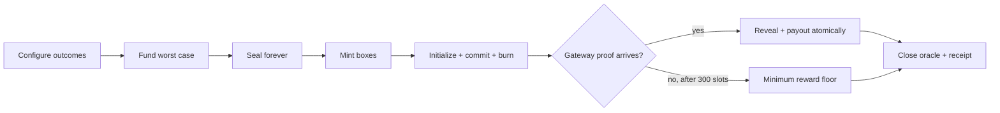

# Lootbox

A small, composable random-reward primitive for Solana, built with [Pina](https://github.com/pina-rs/pina).

Lootbox turns a zero-decimal SPL token into a transferable sealed box. Opening atomically creates and commits fresh Switchboard randomness under a program-controlled receipt PDA, then burns one box. Any relayer can later reveal and settle the fixed recipient's weighted SOL payout in one instruction. Every live box is backed by the maximum possible reward.

> [!IMPORTANT]
> This repository is an internally security-reviewed development MVP, not a mainnet deployment. The web app is a deterministic interaction sandbox; the Surfpool suite is the executable end-to-end proof against real SBF artifacts.

### Treasury template work

The `feat/treasury-templates` branch adds the v2 protocol: reusable templates, finite SOL/token/NFT prize bundles, immutable Token-2022 metadata, earliest claim dates, ordered allocation, independent asset claims, and safe retirement. See the [v2 specification and completion checklist](docs/treasury-templates.md) and [v2 security notes](docs/security-templates.md).

**The existing web app still demonstrates v1.** It is not yet connected to the v2 program. Do not mistake its simulated balances for Surfpool transactions.

A separate persistent, local-only Surfpool service is available for integration:

```sh
devenv shell
build:program
build:test-programs
pnpm playground:rpc
```

It deploys both SBF artifacts and exposes its RPC addresses and oracle fixture accounts at `http://127.0.0.1:8898/config`. It uses an emulated oracle and valueless test balances; restarting clears the network. This is **not a public deployment**.

## What is included

- A `no_std`, Pina-based Solana program with 10 instructions and three PDA account types.
- Switchboard On-Demand initialization, commit, reveal, and close CPIs controlled by each opening PDA.
- Fully collateralized SOL reward vaults, permissionless proof settlement, and recipient-authorized minimum-reward timeouts.
- Codama-generated Rust, TypeScript, and Dart clients.
- Ergonomic checked planning APIs in all three languages.
- An animated React playground with component and Playwright coverage.
- A test-only Switchboard ABI emulator deployed beside the real lootbox SBF program in offline Surfpool.

## Protocol at a glance



The core invariant is:

```text
vault balance - rent reserve >= (mint supply + pending openings) * max reward
```

The program re-evaluates it whenever supply, pending openings, payouts, timeout floors, or withdrawals change.

## Quick start

Enter the pinned development environment and install JavaScript dependencies:

```sh
devenv shell
install:all
```

Run the complete verification suite:

```sh
verify:all
```

Or work in smaller loops:

```sh
build:program
generate:clients
test:unit
test:surfpool
test:web
lint:all
```

Start the UI at `http://127.0.0.1:5173`:

```sh
pnpm --dir apps/web dev
```

## Developer API

The generated clients expose the exact on-chain surface. The handwritten SDK layer catches invalid plans and calculates collateral before a transaction is built:

```ts
import { createLootboxPlan } from "@pina-rs/lootbox";

const plan = createLootboxPlan({
	maxSupply: 250,
	outcomes: [
		{ label: "Static Bloom", weight: 62, rewardLamports: 5_000_000 },
		{ label: "Neon Cache", weight: 28, rewardLamports: 15_000_000 },
		{ label: "Solar Crown", weight: 10, rewardLamports: 50_000_000 },
	],
});

console.log(plan.requiredCollateralLamports); // 12_500_000_000n
```

See [API](docs/api.md), [architecture](docs/architecture.md), [randomness integration](docs/randomness.md), and the [security review](docs/security-review.md) for the full contract.

## Repository map

```text
programs/lootbox_program/       on-chain program and generated clients
sdks/{rust,typescript,dart}/    checked ergonomic layers
tests/fixtures/mock_switchboard test-only oracle SBF program
apps/web/                       animated interaction sandbox
docs/                           protocol and audit documentation
```

Program ID: `Bp6AJD3QQ64kZVfc1YnhP7GN5UBYEHsDXpGUc1xzg4op`

Licensed under Apache-2.0.
