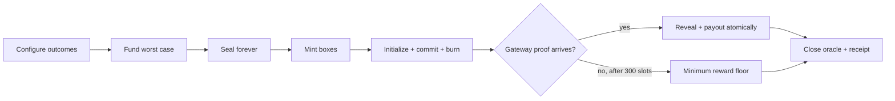

# Lootbox

A small, composable random-reward primitive for Solana, built with [Pina](https://github.com/pina-rs/pina).

Lootbox turns a treasury template into a fixed supply of transferable sealed gifts. The v2 program escrows finite bundles of SOL, tokens, and unique NFTs, then atomically issues one zero-decimal Token-2022 box per bundle copy and revokes mint authority. Opening after the reveal date burns a box and commits fresh randomness; ordered allocation records a complete prize bundle, which can be revealed and claimed asset by asset.

> [!IMPORTANT]
> This is an experimental, internally reviewed development implementation, not an independently audited mainnet release. The web app submits real transactions to local Surfpool. Its assets have no value and its oracle is a test emulator.

### Treasury template work

The v2 protocol includes pre-lock append-only treasuries, fully funded SOL/token/NFT bundles, irreversible exact-supply locking, immutable Token-2022 box metadata, reveal dates, versioned FIFO allocation, independent claims, staged-funding cancellation, timeout forfeiture, and safe retirement. See the [v2 specification](docs/treasury-templates.md) and [v2 security notes](docs/security-templates.md).

**The web app is connected to v2.** Create, fund, publish, append, then mint the exact supply and lock a treasury. Distribute or transfer whole boxes, inspect remaining EV and a constant-product trade preview, then open, reveal, claim, and close the receipt. Creator previews show exact inventory, deposits, and per-copy odds. Searchable Jupiter token and Metaplex DAS asset catalogs are proxied server-side and clearly distinguished from local test fixtures.

A separate persistent, local-only Surfpool service is available for integration:

```sh
devenv shell
build:program
build:test-programs
pnpm playground:rpc
```

It deploys both SBF artifacts and exposes its RPC addresses and oracle fixture accounts at `http://127.0.0.1:8898/config`. It uses an emulated oracle and valueless test balances; restarting clears the network. This is **not a public deployment**.

## What is included

- A `no_std`, Pina-based Solana program with the legacy 10-instruction ABI plus 28 v2 template instructions.
- Switchboard On-Demand initialization, commit, reveal, and close CPIs controlled by each opening PDA.
- Fully escrowed finite SOL, classic SPL, safe Token-2022, Token Metadata/pNFT, Core, and compressed-NFT bundles in v2; the legacy SOL-only v1 retains minimum-reward timeouts.
- Codama-generated Rust, TypeScript, and Dart clients.
- Ergonomic checked planning APIs in all three languages.
- An animated React creator/recipient playground with nested bundle composition, a timezone-aware reveal picker, exact-supply lock workflow, market desk, searchable asset selection, live odds/version/queue state, disposable test wallets, and desktop/mobile Playwright coverage.
- A test-only Switchboard ABI emulator deployed beside the real lootbox SBF program in offline Surfpool.

## Legacy v1 protocol

The SOL-only v1 model below remains ABI-compatible. V2 uses finite bundle inventory and a permissionless timeout forfeiture that unblocks FIFO without returning a rerollable box or changing the bound recipient; see the [template specification](docs/treasury-templates.md).



The core invariant is:

```text
vault balance - rent reserve >= (mint supply + pending openings) * max reward
```

The program re-evaluates it whenever supply, pending openings, payouts, timeout floors, or withdrawals change.

## Quick start

Enter the pinned development environment and install JavaScript dependencies:

```sh
devenv shell
install:all
```

Run the complete verification suite:

```sh
verify:all
```

Or work in smaller loops:

```sh
build:program
generate:clients
test:unit
test:surfpool
test:web
lint:all
```

Keep `pnpm playground:rpc` running after building both programs, then start the UI in another development shell at `http://127.0.0.1:5173`:

```sh
pnpm --dir apps/web dev
```

Follow the [interactive playground guide](apps/web/README.md). No browser wallet extension is required; never use real wallet keys or funds in this local sandbox.

## Developer API

The generated clients expose the exact on-chain surface. The handwritten SDK layer catches invalid plans and calculates collateral before a transaction is built:

```ts
import { createTemplatePlan } from "@pina-rs/lootbox";

const plan = createTemplatePlan({
	name: "A little suspense",
	bundles: [
		{
			label: "A little SOL",
			quantity: 99n,
			assets: [{ kind: "sol", lamports: 100_000_000n }],
		},
		{
			label: "The jackpot",
			quantity: 1n,
			assets: [{ kind: "sol", lamports: 1_000_000_000n }],
		},
	],
});

console.log(plan.totalBundles); // 100n
console.log(plan.fixedSupply); // 100n after market lock
console.log(plan.treasury); // [{ mint: null, amount: 10_900_000_000n }]
```

See the [template API and economics](docs/treasury-templates.md) for token/NFT bundles and `LootboxClient` transaction orchestration. The [legacy API](docs/api.md), [architecture](docs/architecture.md), [randomness integration](docs/randomness.md), and [v1 security review](docs/security-review.md) document the retained SOL-only contract.

## Repository map

```text
programs/lootbox_program/       on-chain program and generated clients
sdks/{rust,typescript,dart}/    checked ergonomic layers
tests/fixtures/mock_switchboard test-only oracle SBF program
apps/web/                       animated interaction sandbox
docs/                           protocol and audit documentation
```

Program ID: `Bp6AJD3QQ64kZVfc1YnhP7GN5UBYEHsDXpGUc1xzg4op`

Licensed under Apache-2.0.
